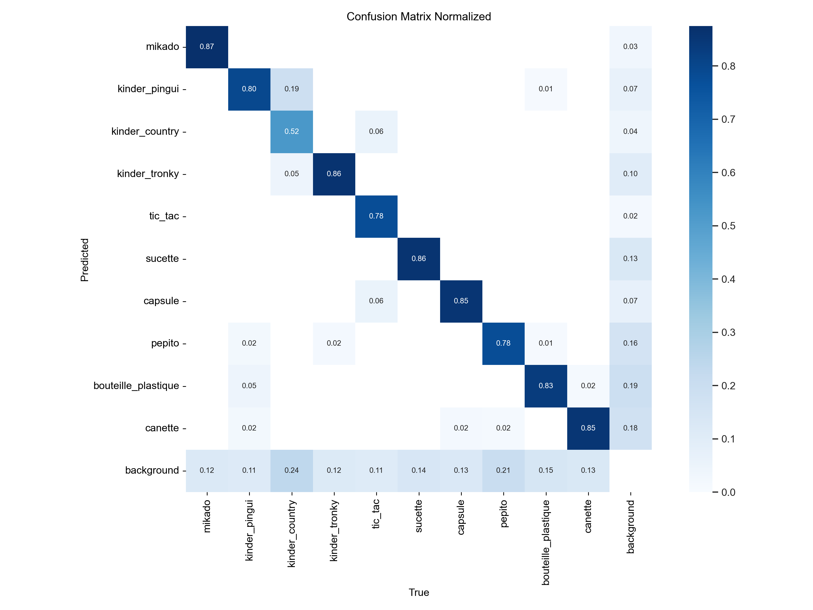

# IA COURS 4 - Projet

## Technologies utilisées
* Version Python : 3.11 🐍
* Formatter : Black ⚫
* Linter : Pylint 🧹
* Static type checker : Pyright 🔍
* Outils de gestion de dépendances : Poetry 📦
* Outils de gestion des pre-commit hooks : Pre-commit 🎣

## Description
Ce projet a pour objectif d'entrainer un modèle d'IA en Python capable de détecter des produits comme des mikado, des kinder pinguin, des bouteilles en plastique, etc..., sur des images, des vidéos ou via une caméra.

Le projet comprend deux pipelines :
* **Pipeline de training** : utilisation d’un dataset annoté sur [Picsellia](https://www.picsellia.com/) pour entraîner un modèle de détection d'objets avec les modèles YOLO d'[Ultralytics](https://www.ultralytics.com/fr).
* **Pipeline d'inférence** : charge le modèle entraîné pour effectuer des détections sur des images, vidéos ou via une webcam.

Picsellia est utilisé pour l'annotation des datasets et le suivi des expérimentationss.
Ultralytics et ses modèles YOLO sont choisis pour la détection d'objets.

## Difficultés et expérimentations

- **Nombre d'epochs** : dépasser les **400-500 epochs** ne semble pas améliorer les performances du modèle. Après ce seuil, l'apprentissage stagne, et les résultats ne changent plus vraiment, peu importe les hyperparamètres.
- **Hyperparamètres** : ajuster les hyperparamètres n’est pas facile. Il est difficile de savoir quels paramètres modifier pour améliorer les performances. Le **fine-tuning** pourrait être une solution, mais avec nos GPU, cela prend beaucoup trop de temps.
- **Problèmes avec CUDA et l'utilisation du GPU**
- **Coordonnées des prédictions** : lorsque l'on log les images de test dans l'onglet **Évaluation** de Picsellia, les coordonnées retournées par Ultralytics sont en **centered-centered**, tandis que Picsellia attend un format **top-left**. Cela nous a pris un moment avant de comprendre d'où venait le problème.
- **Crashs pendant l'entraînement** : quand l'entraînement plante en cours de route :😑.
- **Paramètres ajustés** : nous avons principalement joué avec **epochs**, **patience**, **learning rate**, **batch size** et **img size**.
  - Augmenter le **batch size** rend l'entraînement beaucoup plus long, avec peu de gains en précision.
- **Modèle** : globalement, le modèle est plutôt correct, mais il rencontre plusieurs difficultés :
  - Il confond souvent le **background** avec des objets.
  - Il n'arrive pas toujours à détecter des objets là où ils se trouvent ️.
  - Il a aussi du mal avec les différentes variantes de **Kinder**.
- **Versions de modèle** : nous avons testé différentes versions de YOLO (nano, small, xl...), mais l'entraînement peut alors devenir très long.
- **SDK Picsellia et Ultralytics** : certains snippets de Picsellia ne fonctionnent pas, ce qui nous a fait perdre pas mal de temps.


## Pistes d'amélioration

- L'utilisation d'un dataset plus conséquent pourrait améliorer les performances des modèles entrainés
- **Fine-tuning :** comme mentionné précédemment, le fine-tuning pourrait améliorer les résultats. Cependant, il serait nécessaire de le tester sur des machines plus performantes.

## Meilleur modèle
Disponible [ici](https://app.picsellia.com/0192f6db-86b6-784c-80e6-163debb242d5/project/01936420-552b-796d-a41c-3b3bf1f7348f/experiment/0194df46-9bc6-75ce-87e5-6f4f6f63beb9/)

Version du modèle YOLO utilisé : yolov11l

Hyperparamètres :
```python
lr0: 0.005
seed: 42
batch: 32
cache: true
imgsz: 640
mixup: true
epochs: 300
mosaic: true
augment: true
momentum: 0.9
patience: 50
optimizer: AdamW
close_mosaic: 0
weight_decay: 0.0004
label_smoothing: 0.05
```

Matrice de confusion :



## Installation
```shell
git clone https://github.com/joe67100/ia-cours-4.git
cd ia-cours-4
poetry install

# Si poetry n'est pas installé :
# pip install poetry
```

## Utilisation

Pour lancer une session d'entraînement, utilisez la commande suivante:
```shell
python main.py train [-h] --dataset_version DATASET_VERSION --project_name PROJECT_NAME
```
Example:
```shell
python main.py train --dataset_version initial --project_name Groupe_2
```
---

Pour lancer une session d'inférence, utilisez la commande suivante:
```shell
python main.py infer [-h] --model MODEL --model_version MODEL_VERSION {video,image,camera}
```
Examples:
```shell
# For video
python main.py infer --model Groupe_2 --model_version Groupe_2-55 video "C:\videoplayback.mp4"
```
```shell
# For image
python main.py infer --model Groupe_2 --model_version Groupe_2-55 image "C:\image.jpg"
```
```shell
# For camera
python main.py infer --model Groupe_2 --model_version Groupe_2-55 camera
```

## Liens utiles
- [Picsellia : Projects / Groupe_2](https://app.picsellia.com/0192f6db-86b6-784c-80e6-163debb242d5/project/01936420-552b-796d-a41c-3b3bf1f7348f)
- [**Meilleur model_version**](https://app.picsellia.com/0192f6db-86b6-784c-80e6-163debb242d5/project/01936420-552b-796d-a41c-3b3bf1f7348f/experiment/0194df46-9bc6-75ce-87e5-6f4f6f63beb9/)


## Auteurs

<table style="width:100%; text-align:center;">
  <tr>
    <td><a href="https://github.com/joe67100"></a></td>
    <td><a href="https://github.com/Bricklou"></a></td>
    <td><a href="https://github.com/AIsamet"></a></td>
  </tr>
  <tr>
    <td><a href="https://github.com/joe67100">Joé</a>
    <td><a href="https://github.com/Bricklou">Bilou</a>
    <td><a href="https://github.com/AIsamet">Isamet</a>
  </tr>
</table>
